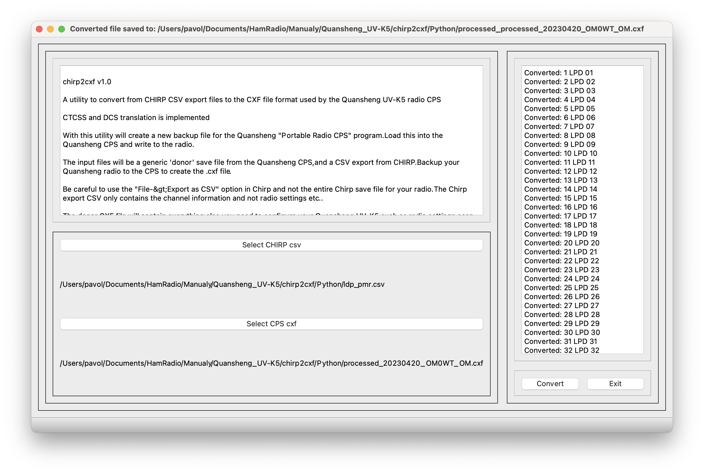

# chirp2cxf 1.0
A utility to convert from CHIRP CSV export files to the CXF file format used by the Quansheng UV-K5 radio CPS written in Python.



With this utility will create a new backup file for the Quansheng "Portable Radio CPS" program. Load this into the Quansheng CPS and write to the radio.

The input files will be a generic 'donor' save file from the Quansheng CPS, and a CSV export from CHIRP. Backup your Quansheng radio to the CPS to create the .cxf file.

Be careful to use the "File->Export as CSV" option in Chirp and not the entire Chirp save file for your radio.The Chirp export CSV only contains the channel information.

The input CXF file will contain everything else you need to configure your Quansheng UV-K5 such as radio settings, scan lists, dtmf things etc.

This utility inserts the CHIRP CSV information into your donor CXF file and provides a result file with the CHIRP channels included. Take this file and load into the Quansheng CPS to program your radio.

Feel free to fork it or contact me if you want at: <om0wt@omradio.sk>

73 de Pavol OM0WT


## Command line and GUI

The program can be invocated from command line, staying in chirp2cxf directory:

```bash
./chirp2cxf/chirp2cxf.py -chirpfile ldp_pmr.csv -cxffile 20230420_OM0WT_OM.cxf -targetfile translated_OM0WT.cxf
```

Processing messages are written on the console:

```bash
2023-06-13 02:08:25.598 | DEBUG    | __main__:<module>:492 - Translating from commandline: CHIRP csv: ldp_pmr.csv, CPS cxf 20230420_OM0WT_OM.cxf and translated cxf file: translated_OM0WT.cxf
2023-06-13 02:08:25.598 | DEBUG    | __main__:csv2cxf:97 - CHIRP file: ldp_pmr.csv, CXF file: 20230420_OM0WT_OM.cxf, OUTPUT file: translated_OM0WT.cxf
2023-06-13 02:08:25.599 | INFO     | __main__:csv2cxf:110 - First part of cxf file written
2023-06-13 02:08:25.599 | INFO     | __main__:csv2cxf:255 - Channel 1 LPD 01 converted
2..
2023-06-13 02:08:25.629 | INFO     | __main__:csv2cxf:255 - Channel 88 PMR 16 converted
2023-06-13 02:08:25.630 | INFO     | __main__:csv2cxf:280 - End of xcf file written to translated_OM0WT.cxf
2023-06-13 02:08:25.630 | INFO     | __main__:csv2cxf:281 - '73 from G1LRO
2023-06-13 02:08:25.630 | INFO     | __main__:csv2cxf:282 - 73 from OM0WT
```

If you run the program without any parameter, GUI interface will appear.

## Installation

Create a python virtual environemnt, activate it and install the dependencies:

```bash
➜  chirp2cxf git:(main) ✗ python3 -m venv venv
➜  chirp2cxf git:(main) ✗ . ./venv/bin/activate
(venv) ➜  chirp2cxf git:(main) ✗ pip3 install -r Python/requirements.txt
Collecting loguru
  Using cached loguru-0.7.0-py3-none-any.whl (59 kB)
Collecting argparse
  Using cached argparse-1.4.0-py2.py3-none-any.whl (23 kB)
Collecting pyqt5
  Using cached PyQt5-5.15.9-cp37-abi3-macosx_10_13_x86_64.whl (7.0 MB)
Collecting PyQt5-sip<13,>=12.11
  Using cached PyQt5_sip-12.12.1-cp311-cp311-macosx_10_9_universal2.whl (142 kB)
Collecting PyQt5-Qt5>=5.15.2
  Using cached PyQt5_Qt5-5.15.2-py3-none-macosx_10_13_intel.whl (40.5 MB)
Installing collected packages: PyQt5-Qt5, argparse, PyQt5-sip, loguru, pyqt5
Successfully installed PyQt5-Qt5-5.15.2 PyQt5-sip-12.12.1 argparse-1.4.0 loguru-0.7.0 pyqt5-5.15.9

[notice] A new release of pip is available: 23.0.1 -> 23.1.2
[notice] To update, run: pip install --upgrade pip
(venv) ➜  chirp2cxf git:(main) ✗
```

## Pyinstaller

Create a macos .app:

```bash
pyinstaller chirp2cxf/chirp2cxf.py -n chirp2cxf --windowed --noconfirm --clean
```